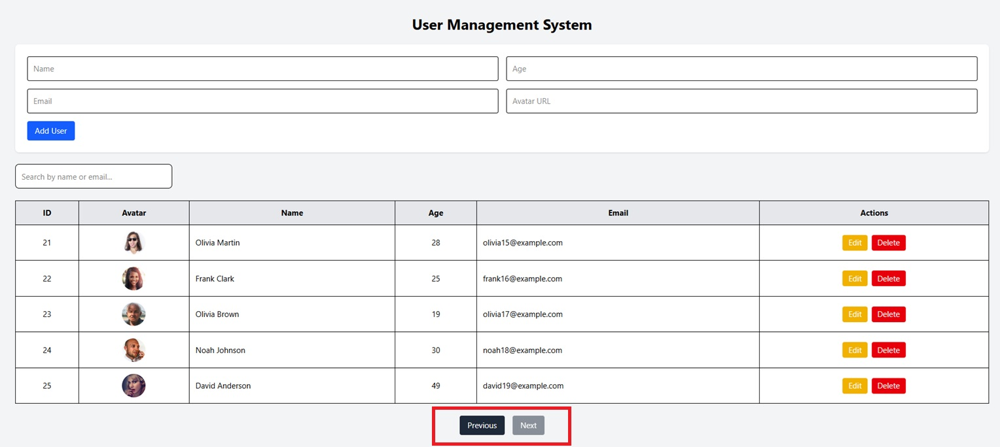
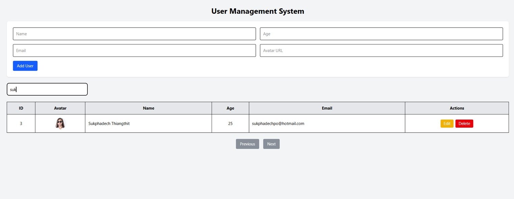

# User Management System

Fullstack CRUD application built with FastAPI, React, and SQLite.

---

# Features

- Create User
- Read Users
- Update User
- Delete User
- Search Users
- Pagination
- Email Validation
- Duplicate Email Protection
- Docker Support

---

# Validation

- Email format validation
- Duplicate email protection
- Required field validation
- Integer validation for age

---

# Tech Stack

## Backend
- FastAPI
- SQLAlchemy
- SQLite

## Frontend
- React
- Vite
- Axios
- TailwindCSS

---

# Architecture

```txt
React Frontend
       ↓
FastAPI Backend
       ↓
SQLite Database
```

---

# Project Structure

```txt
backend/
frontend/
docker-compose.yml
README.md
```

---

# Backend Setup

```bash
cd backend

python -m venv venv

.\venv\Scripts\Activate

pip install -r requirements.txt

uvicorn app.main:app --reload
```

---

# Frontend Setup

```bash
cd frontend

npm install

npm run dev
```

---

# Run with Docker

```bash
docker compose up --build
```

Frontend:
http://localhost:5173

Backend Swagger:
http://localhost:8000/docs

---

# API Endpoints

| Method | Endpoint |
|---|---|
| GET | /api/user |
| GET | /api/user/{id} |
| POST | /api/user |
| PUT | /api/user/{id} |
| DELETE | /api/user/{id} |

---

# Screenshots

## Main Dashboard


## Create User


## Edit User


## Pagination



## Search



## Swagger API Documentation


---

# Future Improvements

- Authentication & Authorization
- Unit Testing
- Deployment to Cloud
- User Profile Image Upload
- Advanced UI/UX Improvements